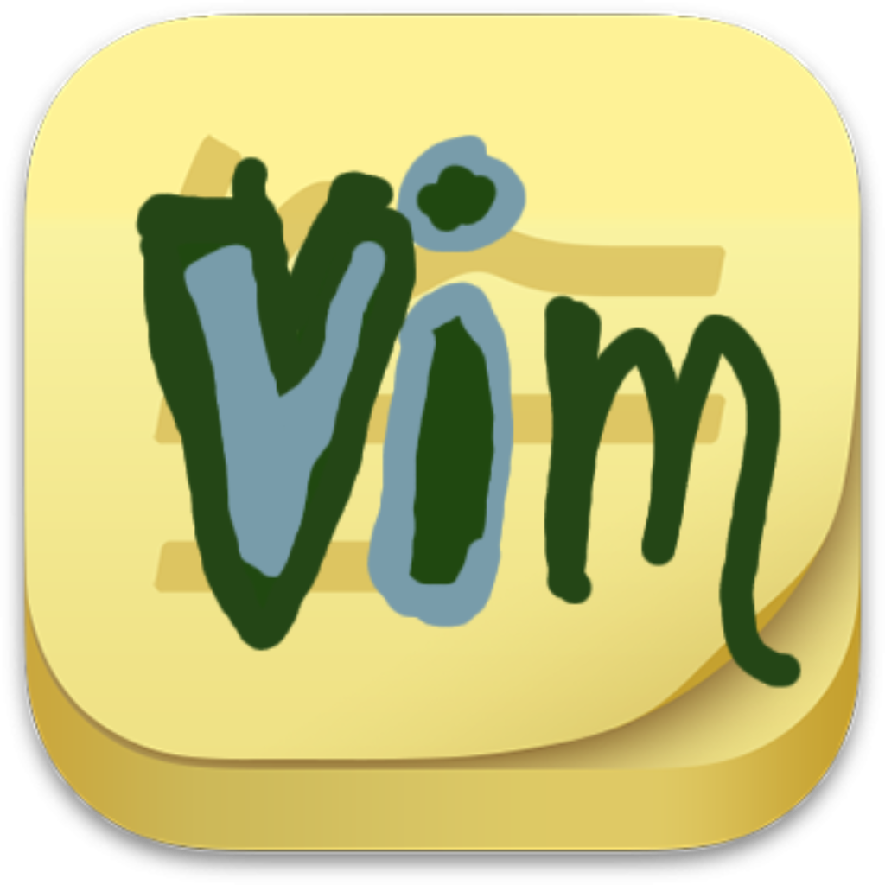

<div align="center">



# aVimStickies

*A markdown sticky-note app for macOS — written in Rust, made for vim users.*

[](https://github.com/OREOREOREOREORE/aVimStickies/releases)
[](#)


This app is only for vim users — if you live in `hjkl`, `yy`, and `dd`, you'll feel at home.

[Install](#install) • [Features](#features) • [Keybindings](#keybindings)

</div>

## Install
One line — the script verifies a published SHA-256 before installing:
```sh
curl -fsSL https://github.com/OREOREOREOREORE/aVimStickies/releases/latest/download/install.sh | sh
```
Or download the `.dmg` from [Releases](../../releases) and drag aVimStickies to Applications.

## Features
- Vim editing + markdown preview (`Cmd+P`) in every note
- Floating windows with remembered position/size, 6-color palette, and pin-on-top
- Auto-save to plain `.md`, live reload on external edits, and cross-note search (`Cmd+Shift+F`) that lists every note on open
- Menu-bar tray with note list; customizable font, size, theme, opacity, and line numbers
- In-app auto-update — a banner appears when a new release is out; one click to install

## Keybindings

| Shortcut | Action |
| --- | --- |
| `Cmd+N` | New note |
| `Cmd+P` | Toggle markdown preview |
| `Cmd+Shift+P` | Pin / unpin note on top |
| `Cmd+Delete` | Delete note |
| `Cmd+Shift+C` | Cycle note color (opt-in) |
| `Cmd+` / `Cmd-` | Increase / decrease font size |
| `Cmd+,` | Open settings |
| `Cmd+Shift+F` | Search all notes |
| `Cmd+W` | Hide note window |
| `Cmd+Q` | Quit |

## Notes data
Plain markdown files in `~/Stickies/` — edit them with any editor and open notes refresh automatically.

## Security
Open source and auditable; downloads come only from this repo's GitHub Releases; the installer verifies a published SHA-256; updates are ed25519-signed and verified; no telemetry. aVimStickies is currently unsigned, so a quarantined copy may need one right-click → Open. Details: [SECURITY.md](SECURITY.md).
